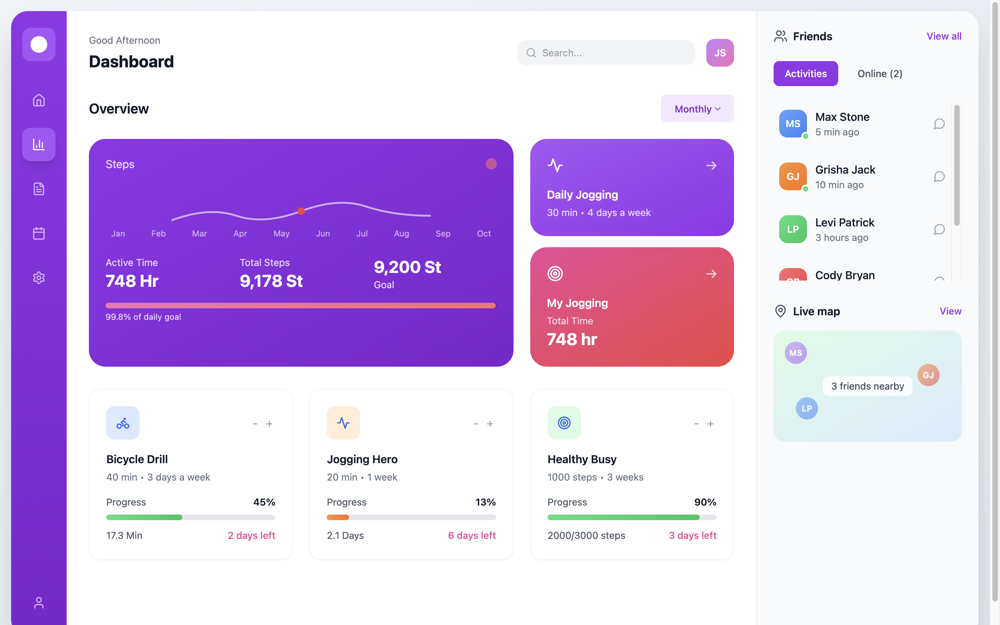
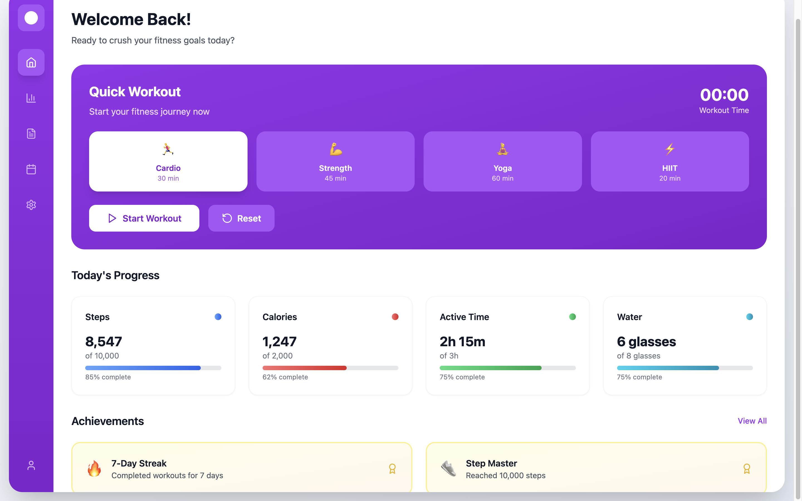
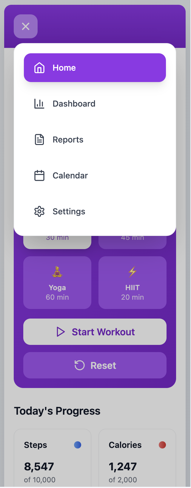
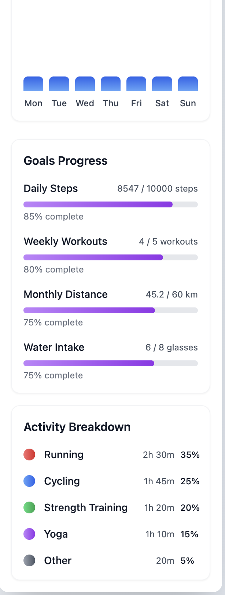
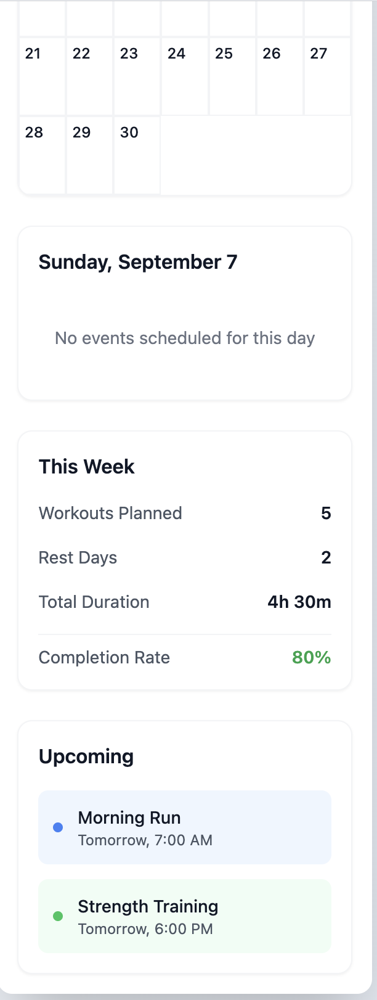

# 🏋️‍♂️ Fitness Dashboard

> **[🚀 Live Demo](https://fitness-dashboard-re-ap5m.bolt.host)**

A comprehensive, modern fitness tracking dashboard built with React, TypeScript, and Tailwind CSS. Track your workouts, monitor progress, manage your fitness calendar, and connect with friends in this beautifully designed application.

## 📱 Screenshots

### Desktop
| Screenshot 1 | Screenshot 2 |
|--------------|--------------|
|  |  |

### Mobile Version
| Screenshot 3 | Screenshot 4 | Screenshot 5 |
|--------------|--------------|--------------|
|  |  |  |

## ✨ Features

### 🏠 Home Dashboard
- **Quick Workout Timer**: Start, pause, and reset workout sessions
- **Multiple Workout Types**: Cardio, Strength Training, Yoga, and HIIT
- **Daily Progress Tracking**: Steps, calories, active time, and water intake
- **Achievement System**: Unlock badges and track streaks
- **Real-time Statistics**: Live updating fitness metrics

### 📊 Analytics Dashboard
- **Interactive Charts**: Monthly step tracking with smooth animations
- **Activity Cards**: Track bicycle drills, jogging, and health goals
- **Progress Monitoring**: Visual progress bars with percentage completion
- **Friends Integration**: See friends' activities and online status
- **Live Map**: View nearby friends and their workout locations

### 📈 Detailed Reports
- **Comprehensive Analytics**: Weekly, monthly, quarterly, and yearly reports
- **Interactive Visualizations**: Bar charts for different fitness metrics
- **Goal Tracking**: Monitor progress towards fitness objectives
- **Activity Breakdown**: Detailed time allocation across different exercises
- **Export Functionality**: Download reports for external analysis

### 📅 Fitness Calendar
- **Full Calendar View**: Navigate through months with ease
- **Event Management**: Schedule workouts, rest days, and nutrition plans
- **Event Details**: Time, duration, location, and participant information
- **Weekly Statistics**: Track planned vs completed workouts
- **Upcoming Events**: Quick view of next scheduled activities

### ⚙️ Settings & Customization
- **Profile Management**: Update personal information and profile picture
- **Notification Controls**: Customize push notifications and email alerts
- **Privacy Settings**: Control profile visibility and activity sharing
- **Appearance Options**: Light, dark, and auto themes
- **Goal Configuration**: Set daily steps, weekly workouts, and other targets

## 🛠️ Tech Stack

- **Frontend**: React 18 + TypeScript
- **Styling**: Tailwind CSS
- **Icons**: Lucide React
- **Build Tool**: Vite
- **Deployment**: Bolt Hosting

## 🚀 Getting Started

### Prerequisites
- Node.js 18+ 
- npm or yarn

### Installation

1. **Clone the repository**
   ```bash
   git clone https://github.com/yourusername/fitness-dashboard.git
   cd fitness-dashboard
   ```

2. **Install dependencies**
   ```bash
   npm install
   ```

3. **Start development server**
   ```bash
   npm run dev
   ```

4. **Open your browser**
   ```
   http://localhost:5173
   ```

### Build for Production

```bash
npm run build
```

## 📱 Features Overview

### Real-time Data Updates
- Live step counting simulation
- Dynamic progress tracking
- Automatic time calculations
- Interactive progress bars

### User Experience
- **Responsive Design**: Works perfectly on all screen sizes
- **Smooth Animations**: Hover effects and transitions
- **Intuitive Navigation**: Easy-to-use sidebar navigation
- **Search Functionality**: Find friends and activities quickly
- **Filter Options**: Sort by time periods and activity types

### Interactive Elements
- **Progress Controls**: Increase/decrease activity progress
- **Time Filters**: Switch between daily, weekly, monthly views
- **Friend Filters**: View all friends or only online ones
- **Calendar Navigation**: Navigate months and select dates
- **Settings Management**: Update preferences and goals

## 🎨 Design Philosophy

This application follows modern design principles with:

- **Apple-level Aesthetics**: Clean, sophisticated visual presentation
- **Consistent Color System**: Purple gradient theme throughout
- **Typography Hierarchy**: Clear information structure
- **Micro-interactions**: Subtle animations for better UX
- **Accessibility**: High contrast ratios and readable fonts

## 📊 Component Architecture

```
src/
├── components/
│   ├── Dashboard.tsx      # Main analytics dashboard
│   ├── Home.tsx          # Home page with quick actions
│   ├── Reports.tsx       # Detailed analytics and reports
│   ├── CalendarPage.tsx  # Fitness calendar management
│   └── Settings.tsx      # User preferences and settings
├── App.tsx               # Main application component
├── main.tsx             # Application entry point
└── index.css            # Global styles
```

## 🔧 Customization

### Adding New Workout Types
```typescript
const workoutTypes = [
  { id: 'cardio', name: 'Cardio', duration: '30 min', calories: '250 cal', icon: '🏃‍♂️' },
  // Add your custom workout type here
];
```

### Modifying Color Scheme
Update the Tailwind configuration in `tailwind.config.js` to customize the color palette.

### Adding New Features
Each page component is modular and can be extended with additional functionality.

## 📈 Performance

- **Fast Loading**: Optimized with Vite build system
- **Smooth Animations**: 60fps transitions and hover effects
- **Efficient Rendering**: React 18 with optimized re-renders
- **Responsive Images**: Optimized assets for different screen sizes

## 🤝 Contributing

1. Fork the repository
2. Create your feature branch (`git checkout -b feature/AmazingFeature`)
3. Commit your changes (`git commit -m 'Add some AmazingFeature'`)
4. Push to the branch (`git push origin feature/AmazingFeature`)
5. Open a Pull Request

## 📄 License

This project is licensed under the MIT License - see the [LICENSE](LICENSE) file for details.

## 🙏 Acknowledgments

- Design inspiration from modern fitness applications
- Icons provided by [Lucide React](https://lucide.dev/)
- Images from [Unsplash](https://unsplash.com/)
- Built with [Vite](https://vitejs.dev/) and [React](https://reactjs.org/)

## 📞 Support

If you have any questions or need help with the application, please:

1. Check the [Issues](https://github.com/yourusername/fitness-dashboard/issues) page
2. Create a new issue if your problem isn't already listed
3. Provide detailed information about your environment and the issue

---

**[🚀 View Live Demo](https://fitness-dashboard-re-ap5m.bolt.host)** | **[📖 Documentation](#)** | **[🐛 Report Bug](#)** | **[💡 Request Feature](#)**